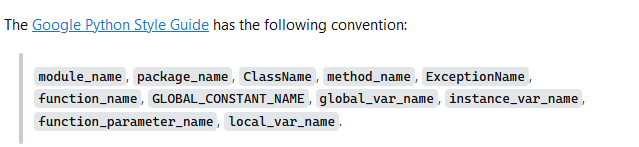

# Overview
This will be dense, and there's quite a bit of theory. You are going to learn how to concretely organize your projects and future work. What you learn here applies to all programming languages, you'll just have to use other design patterns and folder names and stuff.
We will be covering: 
- Scope (how it affects memory, and how variables are declared.)
- File organization patterns

Quite a lot of work, so we're going to jump into it.

# Scope
Scope is an important aspect of programming. If you understand it you will be able to understand file organization and how to go about it.

## What is scope?
Variables are limited to a "scope". Your eyes are probably rolling right now, "Great, what is scope then?". To do that, we will go a bit behind the scenes of the computer you have.

### Purpose of Scope
Your computer, has two *really* essential components, those are; the processor, and RAM (there are more components, but we will focus on these.). If you open your task manager, you can find those, and as you can notice and presumably know, they have a limited amount of resources available to themselves.

The processor does the calculations, the beep boops. You tell it ` 3 + 5 ` and it tells you `8`
The RAM **(Random Access Memory)**, takes the beep boops and keeps them for future use.
` a = 8 `

That's cool and all, but now you may be wondering, "isn't it possible for me to make toooooo many variables? Is there a way to make old variables just disapear into the aether?"

Why yes there is!

### Global and local scope
Scope is of two types: Global and local.

#### Global Scope
Global scope, pertains to variables and functions that can be accessed from anywhere from within the file you are in.
```python
food = "Banana"

def eat():
    print("I am eating the " + food)

def buy():
    print("I am buying the " + food)

buy()
eat()
```
The food variable, will be here forever in our RAM. But that is fine, cause I am currently thinking about bananas and bananas only. (I actually hate them honestly.)
But you can't just make 50000000000000 food strings for each and every single one of your needs, that would overwhelm your RAM.

With great power, comes even greater responsibility. Make as few global variables as possible, but don't shy away from using them when need be. It is important to note, the moment your program stops executing, the global variable gets ejected from RAM, so you can't fuck up your PC.

#### Local Scope
Local scope, pertains to variables and functions that can be accessed only from inside the function you're currently working in.
```python

def eat(food):
    print("I am eating the " + food)

def buy(food):
    print("I am buying the " + food)

buy("Groceries")
eat("Chocolate")
```
The food variable, exists inside the eat and buy function. The moment the function finishes or returns, the food variable gets ejected from the RAM, meaning you can't access it anymore and the computer can use that memory for something else.

### TLDR?
Scope represents the level of access and importance a variable has, if a variable is global, then it can be accessed from anywhere, but you also can't get rid of it. If a variable is local, then it can only be accessed from inside the function block you are currently in. Think of the project you're working on, what do you think would be the best global variables? What about local?

# File Organization
Now that you know what scope is, you will be able to use it more effectively, and you will learn how to organise your project in a better fashion. Organizing files is a big aspect of programming.

There is no *right* way to organize files, but there are some common patterns among all organization structures.

## Main
If you go back, you can see a demo, you can download it for view. It is essential every project has a "main" file and function. It makes it easy for other programmers to read your code, and it makes it easier for you to debug your own code.

The main file has the overall architecture of your project, and it will import most of the functions that it will use from other files.

Below, I have attached a file from the demo:

[Main example](./demo/main.py)

The project itself is a rework of the calculator, so scroll around and maybe you'll learn some new stuff.

### What is the purpose of the if main sequence?
`if __name__ == "__main__":` triggers only when you run that file specifically. Basically, if you run: 

`py main.py`

it ensures that certain code runs only if the script is executed directly, not when it’s imported as a module. This allows for testing specific functions or code blocks.

This can actually be really useful! You can use it to test the functions before implementing them. [Here is an example](./demo/calculations.py)
Pretty cool right? Debugging at your leisure.

## Typing in Python

I recommend you pick a writing style for your work from now on. Whenever you will jump from a programming language to another, there's different writing conventions. Annoying, I know. In python, they use the snake_case, below you have all the things you'll ever write in python, and how they're written.



There is no right way to type that would work for all languages, you will have to look up for naming conventions in any future languages will work in.
In Java right now I am working in camelCase.
In JavaScript, I used PascalCase.

Live and learn. You won't be perfect, but you can ask chatGPT to check your code for the right formatting, or some other AI.

That would be it. This one was a long one. I hope it helps.