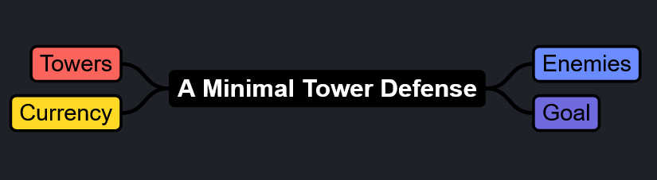
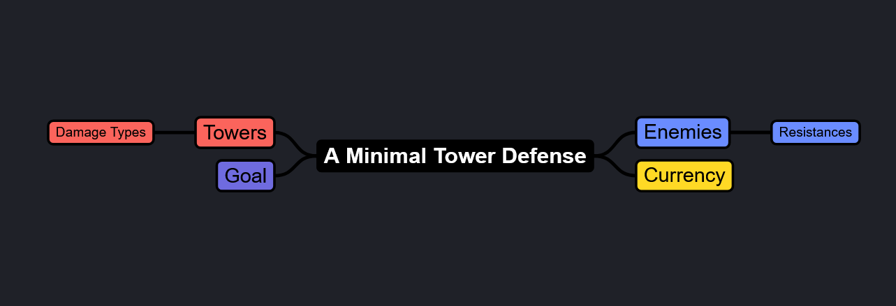
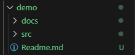

# Overview
This time, we are going to talk about user stories, design methodology, and documentation. It'll be quite a lot so, let's get started.

This applies in most fields of engineerings, and also in art, and it'll be a lot more me talking from previous experience. Maybe this won't work, but you'll find a fuck ton of other methods of work, so please explore on your own, and find what best suits you.

# User Stories
## What is that?
User stories are a methodology of organising your project and your goals. They help you mentally recognise what you need to do it, how you need to do it, and why you need to do it. A user story is formed like this:

`As a _________ I need a _________ in order to _________`

Below are some *examples*.

### Examples

`As a player I need to be able to see the enemies on the map in order to avoid them and kill them.`

`As a player I need to be able to control my player char in order to have control of the game.`

`As a developer I need multiple files in order to more easily find the code I want to edit.`

As you can see, this kind of helps you understand the where, what, and why. Now question is, how do you apply it?

## How do I use this?
Cool, but this seems a bit hard to apply. Let's think to your past project. How would I do it? And by extension, how could you apply this to your future work. Continuing forward, we will talk about design methodology and how to figure out what the requirements are.

# Design Methodology

How do you design something? How do you figure something out? Well, there's a zillion design methodologies. When it comes to programming and projects of the sort, you will *always* have some kind of requirement, and they'll be a good way to guide your train of thought.

If you have to make a tower defense game on a 2D map, how do you interpret that?
First you do by searching what a tower defense game. Oh, so it's a kind of game where you place towers and they defend a thing for you. Okay... if it's a 2D map then the towers can only look in 2D. The enemies seem to always go down a specific path, so that's another thing. There's multiple towers...multiple types.

Wow look at that, just like that, you made on your own, SOOOOO many different requirements. Some are more important than others, but at least you have the feel for them now.

You can make some **user stories** based on what you saw, or you could get to making a *mind map*, or maybe a *design document*. A lot of the times it's a good idea to make all three.

So, tower defense. Let's see. What is a good mindmap for start...

That's good, we have something. Let's see...

`As a player, I need towers in order to defend myself from enemies.`

Cool... what else

`As a player, I need tower types, so I can deal different types of damage to the enemies`

Oooooo, now that's something you can add extra, and because you want to add tower types, then maybe you can:

`As an enemy, I need resistances so I can resist certain types of damage and give the player a challenge`

Look at that. Cool. You can already make a project out of this.
This is a design document, at least one example of design document. Always keep your design documents to one page only. Remember, you are not making design documents for yourself only, you are making design documents for others ***and*** for your future self. Your future self doesn't know what the present self is doing. Make it for the lowest common denominator as possible.

You can save your user stories in a separate document, and make more mind-maps and design documents as time goes on, depending on what you're working. Hell each of the items I placed here deserves a mind map and a design document of their own if you really want to delve into it, but you're studying programming so you can just focus on programming first and asking questions later.

# Project Documentation

All of these are pretty valuable documents. Whenever you work in a project repository, I recommend you make a folder for the *source code* of the project, generally called `src`. Here you place all the code and all the monkey stuff, the executable, stuff like that.
A new folder would be nice to make, and there you can place all the documentation.

That's cool, but having a project with multiple folders can be hard to explore, and setting the app up could also be a hassle, even with the main function. The more folders, the harder it is to explore.

This is where Markdown files become really important.
Markdown files are text files which you use to write readmes, and are basically the documentation apps for programmers. It is genuienly one of the best writing tools you can have and I recommend you use it if you need to condense big information.

This would conclude the course. There's quite a lot more, and some of it you will learn on your own. But hopefully next time you'll be less stuck on designing your project.

PS: MAKE SURE TO EXPLAIN HOW TO USE YOUR APP. IDEALLY IT'S SELF EXPLANATORY, BUT MAKE HELP MENUS/EXPLAIN IN THE README!