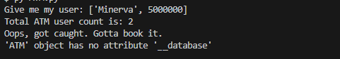

# Object Oriented Programming Principles
## Overview
Well, you know what objects are, and you know what classes are. How do we use them, and what are some of the principles behind using them.
Well, here is the list, time to go into them:

***1. Encapsulation***

***2. Abstraction***

***3. Inheritance***

***4. Polymorphism***

***5. Association***

Let's go through them one by one.

## 1. Encapsulaton
We kinda went through that the last set of exercises, but encapsulation means the binding of data and functions together, allowing them to alllllllll work together nice and well. It is great to make the code readable and easy to copy and paste.

## 2. Abstraction
Abstraction means the hiding of internal components and showing only the features that are required. Let's say you have an ATM machine, what you would want a person to see would probably be the results of their bank account right? You don't want them to see *the* wholeee database. That would be bad.

[This code is here.](./demo/Abstraction.py)
```python
class ATM():
    def __init__(self):
        # The database holds a list that contains: 1. username 2. money
        self.__database = [["Minerva",5000000],["You",0]]
        self.total_user_count = len(self.__database)
    def return_specific_user(self,user):
        return self.__database[user]


if __name__ == "__main__":
    atm = ATM()
    print(f"Give me my user: {atm.return_specific_user(0)}")
    print(f"Total ATM user count is: {atm.total_user_count}")
    try:
        print(f"I am a hacker, give me your database! {atm.__database}")
    except Exception as e:
        print(f"Oops, got caught. Gotta book it. \n{e}")
```

So, let's think about it. We want to show them only specific entries of the database right? But maybe you'd want to show the total amount of users for an API.
```python
        self.__database = [["Minerva",5000000],["You",0]]
        self.total_user_count = len(self.__database)
```
Here we are learning two things (for now):
- **Private access**
- **Public access**

In classes, you can set variables *and* methods to be public or private. Let's talk about what this kind of access does.

### Public Access

The total_user_count can be accessed from the outside of the class, so when we call atm.total_user_count we get the number no problem. We can also edit the value from outside, so we can call: 
`atm.total_user_count = 3`

This is suboptimal. You should probably not do that. 99% of your variables should always be private (or protected but I'm getting ahead of myself.) Methods should *mostly* be public.

### Private Access

The database is private. If I try to print the whole database, it won't let me at all. I can't edit the database by trying to access it like that, so if I'll ever want to edit or read through it, I'll need to create functions for it. This is perfect for security reasons.


#### Demonstration of the principles
The try catch segment takes the error and prints it, we will talk about error handling another time. Here's how the abstraction works based on the code above.



Can't access the whole database, that's good.

So, you use abstraction to keep data safe, and to make sure you have healthy coding principles, so you have more guardrails. Cooooooool.

This concludes *most* of abstraction.

## 3. Inheritance
Sometimes, classes are really similar to eachother. Inheritance is the principle that allows one class to inherit the traits of another, and to use them for its own goals. Everything a class has can be inherited by another.

*(don't mind the code, it doesn't have abstraction principles, too lazy to edit it.)*

[This code is here.](./demo/Inheritance.py)
```python
class Vehicle():
    vehicle_number = 0

    def __init__(self,vehicle_name,top_speed):
        self.vehicle_name = vehicle_name
        self.top_speed = top_speed
        self.speed = 0
        Vehicle.vehicle_number += 1

    def accelerate_change(self,change_of_speed):
        # We take both accelerations and decelerations here.
        self.speed += change_of_speed
        if self.speed < 0:
            self.speed = 0
        elif self.speed > self.top_speed:
            self.speed = self.top_speed
    

    def drive(self,drive_cycles):
        print("\n",self.vehicle_name,"\n")

        for i in range(0,drive_cycles,1):
            self.accelerate_change(10)
            self.information()

        while(self.speed > 0):
            self.accelerate_change(-10)
    

    def information(self):
        print(self.vehicle_name, " is driving at ", self.speed, " kph")
    

    def total_vehicles():
        print(f"\nCurrently there are {Vehicle.vehicle_number} vehicles.\n")


class Bus(Vehicle):
    bus_number = 0

    def __init__(self,vehicle_name,top_speed,passenger_capacity):
        super().__init__(vehicle_name,top_speed)
        self.passenger_capacity = passenger_capacity
        self.current_passenger = 0
        Bus.bus_number += 1
    def load_unload_passengers(self,target_passenger):
        self.current_passenger = max(min(self.passenger_capacity,target_passenger),0)
        print(f"Currently the count of passengers is: {self.current_passenger}.")
    def total_busses():
        print(f"\nCurrently there are {Bus.bus_number} busses.\n")


if __name__ == "__main__":
    DRIVE_CYCLES = 15
    vehicle_list = [Vehicle("Subaru",200),Vehicle("Porsche",120),Vehicle("Jeep",90),Bus("Volvo Bus",70,60)]
    for vehicle in vehicle_list:
        if isinstance(vehicle,Bus):
            vehicle.load_unload_passengers(30)
            vehicle.drive(15)
            vehicle.information()
            vehicle.load_unload_passengers(0)
        else:
            vehicle.drive(15)
            vehicle.information()
    
    Vehicle.total_vehicles()
    Bus.total_busses()
```
As you can see in the code above, the Bus class inherits the traits from the vehicle class. The bus is able to drive like the vehicle, accelerate, and print information, all that stuff. Yippeeeeee

Now what's cool is, the Bus is also able to load and deal with passengers,WHILE keeping the ability to drive like a normal vehicle.

Inheritance is used to allow sub-classes to use the code of the parent classes.

## 4. Polymorhpism
In OOP, an object or method can have more than just one method associated with them.

[This code is here.](./demo/Polymorphism.py)
```python
class Bus(Vehicle):
    bus_number = 0

    def __init__(self,vehicle_name,top_speed,passenger_capacity):
        super().__init__(vehicle_name,top_speed)
        self.passenger_capacity = passenger_capacity
        self.current_passenger = 0
        Bus.bus_number += 1
    def load_unload_passengers(self,target_passenger):
        self.current_passenger = max(min(self.passenger_capacity,target_passenger),0)
        print(f"Currently the count of passengers is: {self.current_passenger}.")
    def total_busses():
        print(f"\nCurrently there are {Bus.bus_number} busses.\n")
    def information(self):
        print(self.vehicle_name, " is driving at", self.speed, " kph. It is currently carrying ", self.current_passenger, "/", self.passenger_capacity)
```

If you look here, you will notice that the bus itself also has an information method. When you will run the code, the bus will use the information method of the bus, and not the method from the Vehicle. This concept is extremely useful because you can adjust the methods and variables so they work better for the specific class.

## 5. Association
Ah, yes. Association. I've been doing it throughout the exercise sets, and you can probably infer what it means.
Objects can be associated with eachother, wether a class detains an instance of another object, or the objects are allllllll contained in a nice little list or dictionary so you can keep them all nice and tidy. There is more to talk about, but we'll go into it later.
[This code is here.](./demo/Association.py)
```python
    class Human:
    def __init__(self,name,heart):
        self.name = name
        self.__heart = heart
    def get_heart(self):
        print(f"{self.name}: Ouch,owie.")
        return self.__heart

class Heart:
    def __init__(self,bpm,type_of_heart):
        self.__bpm = bpm
        self.__type = type_of_heart
    def information(self):
        print(f"Interesting, a heart that can reach up to {self.__bpm} and is {self.__type}")

if __name__ == "__main__":
    human = Human("George",Heart(200,"Impure"))
    ritualistic_sacrifice_result = human.get_heart()
    ritualistic_sacrifice_result.information()

```